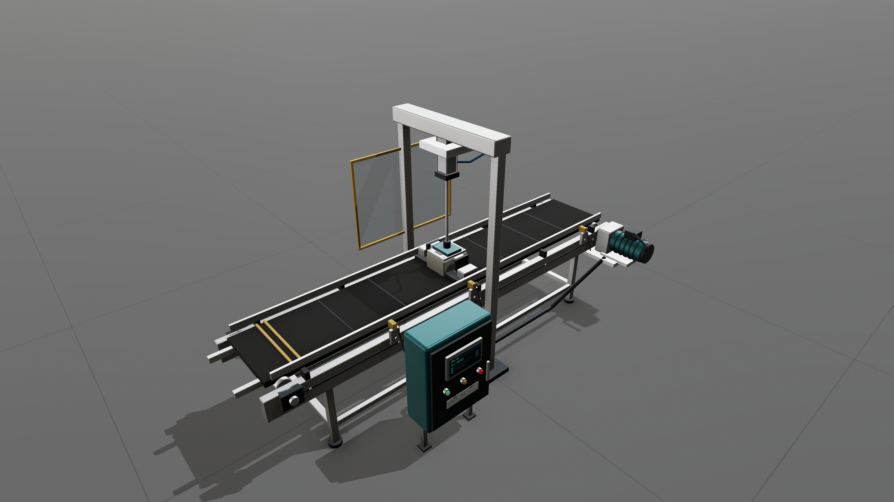
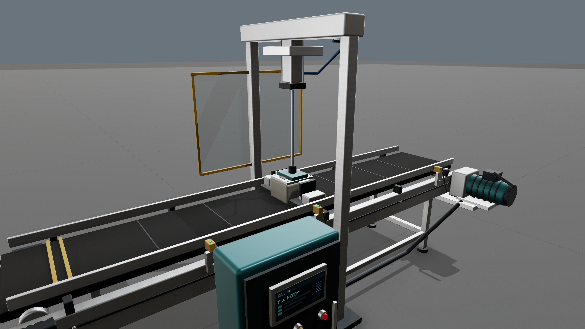
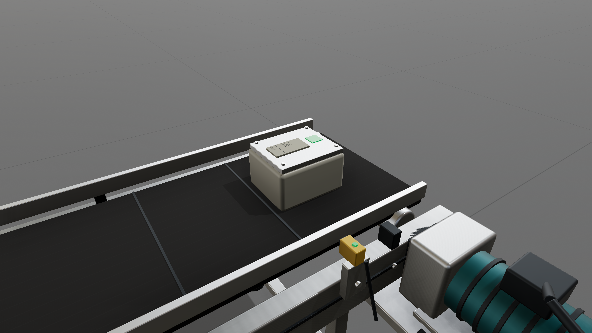
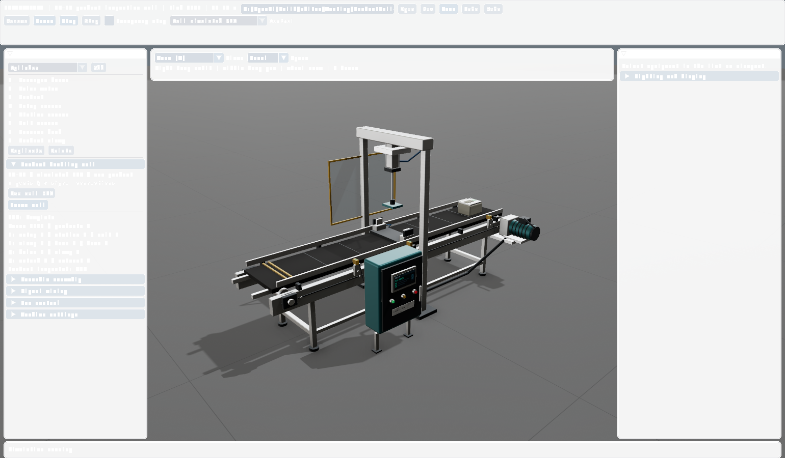

# FC-01 product inspection cell

This repeatable test starts with an empty editor, installs eight equipment components through visible editor controls, wires their five signal connections, saves/reloads the machine, and uses a cyclic simulated PLC to process and discharge one product. It ends by clicking Stop and verifying that authored configuration is restored.

## Run the complete editor test

```powershell
.\Install\bin\FactoryCoreEditor.exe --cell-test --capture Build/ProductCell/Editor-Complete.png
```

A Vulkan GPU is required. The test uses an explicit 10 ms simulation/PLC scan, independent of wall-clock rendering speed. It injects real mouse events into the guided assembly, wiring, save, PLC-selection and playback controls. Component names, kinds, placements, properties and model references are checked after installation; saved wiring is loaded and validated before playback.

The output folder contains five 3840 × 2160 render captures, editor screenshots, the assembled ProductInspectionCell.factory and PLC-Trace.csv. The high-resolution captures render at 7680 × 4320 and downsample on the GPU; they depict the actual simulated scene.

For manual operation, open the packaged example:

```powershell
.\Install\bin\FactoryCoreEditor.exe --machine Install/share/FactoryCore/Examples/ProductInspectionCell.factory
```

Choose **Cell simulated PLC**, press **Frame cell**, then **Play**. To build it yourself, start with New, expand Product handling cell, click Add next cell part eight times, then Wire next cell signal five times. Guided placement supplies the dimensions and station settings for this example. Each part remains editable through the ordinary inspector and gizmo. Save writes a reusable machine configuration.

## Equipment and wiring

| Component | Function |
| --- | --- |
| Conveyor frame | Belt, rollers, bearings, extrusion frame, gantry, guards, PLC cabinet and operator panel |
| Drive motor | Drives the conveyor; its acceleration/deceleration contributes to belt stopping distance |
| Product | Transported housing with lid, screws, serial identification and visible inspection mark |
| Entry sensor | Confirms that the product entered the cell |
| Station sensor | Triggers stopping at the processing station |
| Exit sensor | Confirms discharge |
| Process head | Pneumatic cylinder lowers the process pad onto the product |
| Product clamp | Confirms delayed clamp actuation before the process head moves |

The wiring connects Motor.Active to Conveyor.Enable, Conveyor.Velocity to Product.Velocity, and Product.Position to each sensor's Position input. Connections retain the core's one-scan sampling latency.

## PLC sequence

The controller reads an input image once per scan, evaluates its sequence, and applies its output image transactionally before the equipment tick. The editor displays sensor/clamp/head feedback, drive/clamp/head commands, scan count, sequence state and completed-product count.

The sequence is Feeding → Locating → Stopping → Clamping → Extending → Processing → Retracting → Releasing → Discharging → Stopping outfeed → Complete. It waits for the motor and conveyor to stop before clamping, requires clamp and head-down confirmation before processing, holds for 0.45 seconds, marks the product inspected, and waits for the head to retract and clamp to release before discharge.

Nominal settings finish one product in 1,220 scans / 12.20 simulated seconds. The product remains still during clamping/processing and finishes at 2.548 m of transport travel. Its Processed flag latches during the live run and resets when playback stops or the machine resets. Configuration saves exclude that live flag.

Equipment faults, emergency stop, invalid sensor ordering and a 20-second state timeout latch a PLC fault. Drive and head commands turn off. Stop restores the authored machine; an explicit new Play starts a fresh PLC. The unit test interrupts three cycle phases with emergency stop, injects an equipment fault, withholds a sensor, rejects missing wiring and verifies transactional output failure.

This controller is a simulated PLC implemented against IController. It does not communicate with a physical PLC. External PLC integration requires the target model and protocol. Equipment remains an idealized kinematic model; clamp/head confirmations and the inspection mark represent the control workflow, without a force/contact solver.

## Render evidence

The detailed glTF assets use beveled surfaces, machined-metal normals, rubber textures, distinct coatings, polycarbonate guards, pneumatic fittings, cable routes, fasteners and identification textures. Lighting uses the bundled 2K Machine Shop 02 CC0 HDRI for reflections, filtered 4096-pixel cascaded shadows, SSAO, ACES fitted filmic tone mapping and a neutral studio backdrop. The camera preserves glTF orientation, so markings remain readable.







